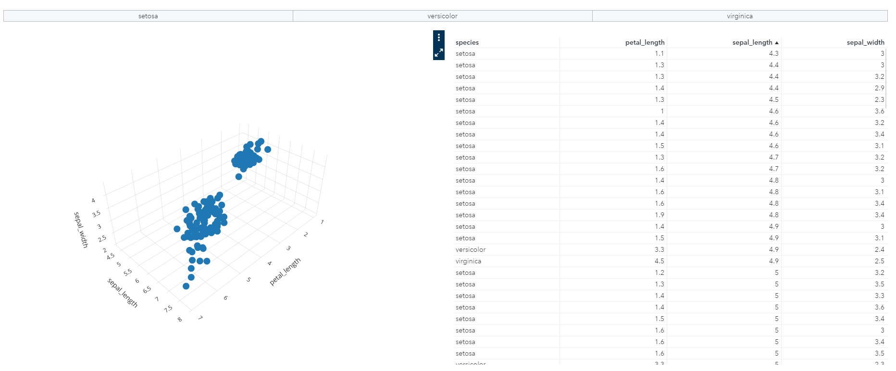
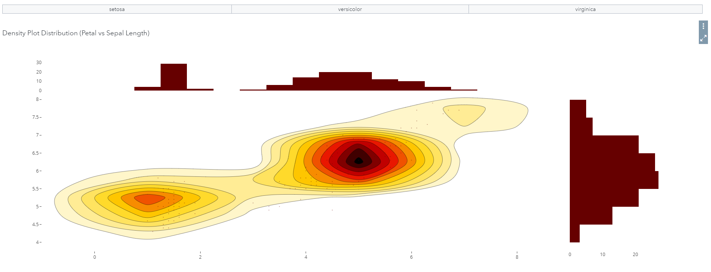

Links to use in the Data Driven Object options:

- [3d Plot](https://pierpaolo28.github.io/Open-SAS-Analytics/viya_plotlyjs/3dplot.html)

- [Density Plot](https://pierpaolo28.github.io/Open-SAS-Analytics/viya_plotlyjs/densityplot.html)

For more ideas, example plots are available in the [Plotly documentation](https://plotly.com/javascript/). An example SAS Viya report is available at [this link.](https://viyawaves.sas.com/SASVisualAnalytics/?reportUri=%2Freports%2Freports%2F1f3be09a-1354-499c-9cf3-1afb165f8675&sectionIndex=0&sso_guest=true&sas-welcome=false) 